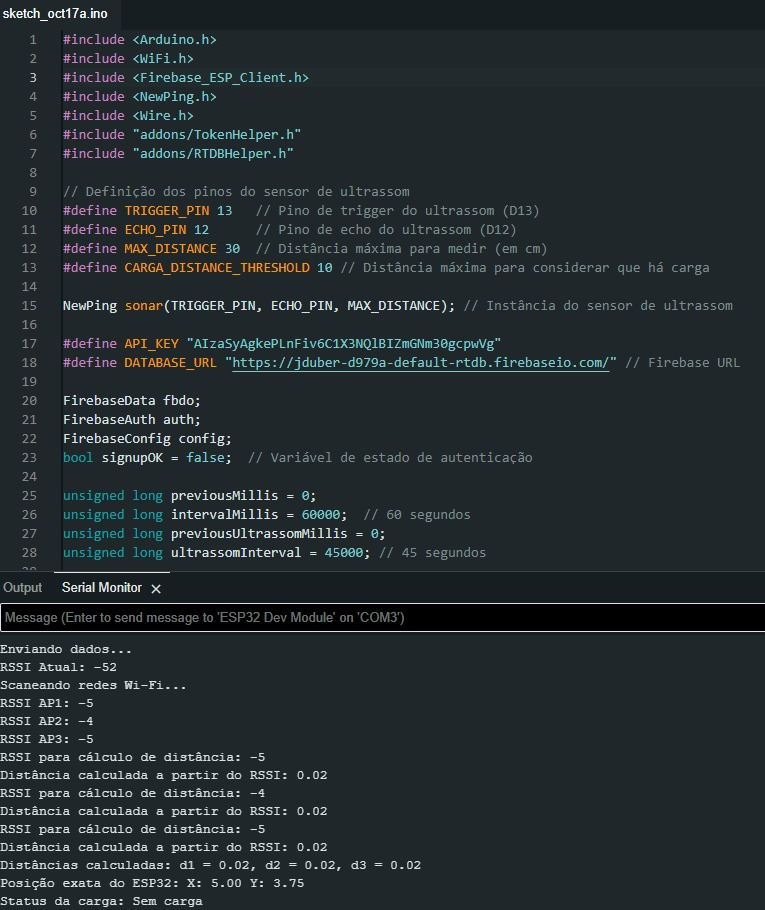
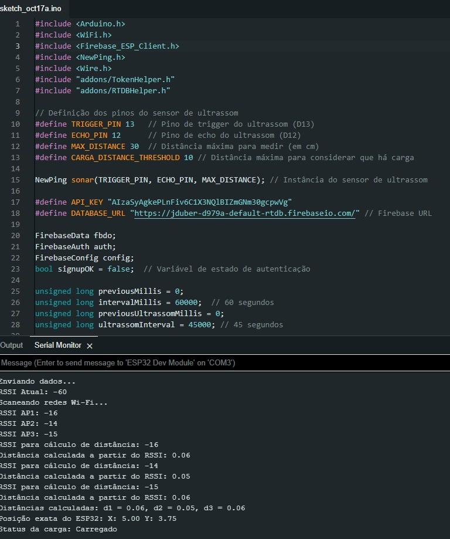

# Desenvolvimento

## Arquitetura do Sistema

A solução proposta utiliza um ESP32 como dispositivo IoT para rastrear a localização de carrinhos na fábrica da John Deere. 

### Componentes
1. **ESP32**: Responsável por capturar os dados de localização e transmitir ao servidor.
2. **Servidor**: Hospedado na nuvem (ex: AWS, Firebase), responsável por armazenar e processar os dados recebidos.
3. **Frontend**: Interface gráfica onde os dados são exibidos para os usuários, implementado em HTML/CSS/JavaScript.
4. **Plataforma de Integração IoT**: Exemplo, Ubidots ou Firebase, utilizada para gerenciar os dados do ESP32.

### Tecnologias Envolvidas
- **ESP32**: Microcontrolador IoT usado para a coleta de dados.
- **Firebase**: Banco de dados em tempo real e backend para armazenamento.
- **Mapbox**: Usado para visualização de mapas indoor.
- **Hostinger**: Hospedagem do site e integração com o backend.

## Funcionamento

1. O ESP32 coleta dados da plataforma/carrinho usando sensores.
2. Os dados são transmitidos para o servidor utilizando o Wi-Fi interno da fábrica.
3. O servidor processa os dados e atualiza a localização dos carrinhos em tempo real.
4. A interface web exibe a localização e status dos carrinhos.
5. Resultado esperado: um sistema eficiente de rastreamento de plataformas dentro da fábrica.

---

# Resultados

A aplicação desenvolvida é capaz de:
- Monitorar a localização de plataformas de forma precisa e em tempo real.
- Exibir as rotas dos carrinhos na fábrica em um mapa interativo.
- Abaixo estão alguns prints demonstrando o funcionamento da aplicação:

Spint 4 Testando o ESP32

Ferramenta de teste:
- A ferramenta de teste utilizada no projeto John Deere é uma interface de mapeamento e monitoramento de veículos de carga na fábrica. Essa ferramenta permite simular e verificar o funcionamento de um sistema de localização em tempo real de carros-kits, empregando triangulação por Wi-Fi e sensores de ultrassom conectados a um ESP32. Ela permite identificar a presença de carga, a posição precisa do veículo no mapa interno da fábrica e exibe as informações coletadas diretamente na plataforma web.

Para o teste de conectividade e precisão do sistema, são utilizadas ferramentas de triangulação e o Firebase para armazenamento e recuperação de dados em tempo real. Essas verificações visam assegurar que o ESP32 (apelidado de Breno e Nunes) esteja se conectando corretamente ao Wi-Fi, recebendo e transmitindo dados sobre o status de carga e localização do carro de peças.

Evidências de Testes:
Conexão do ESP32 ao Firebase: Uma captura de tela mostrando a comunicação em tempo real com o Firebase, onde os dados de posição e status de carga são atualizados automaticamente conforme o carro se move ou detecta uma carga. Além de que  um teste com o sensor de ultrassom indicando a presença de carga no carro. Com a presença de um objeto , o sistema indicou “Carregado”; com a ausência de carga, a distância o status mudou para “Sem carga”.
.
.

